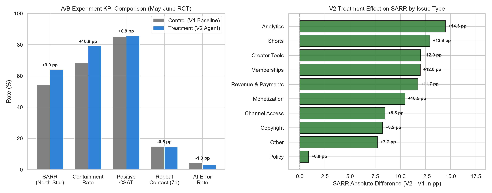
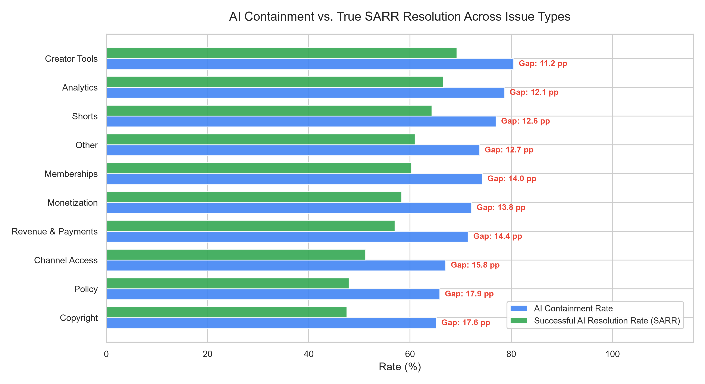
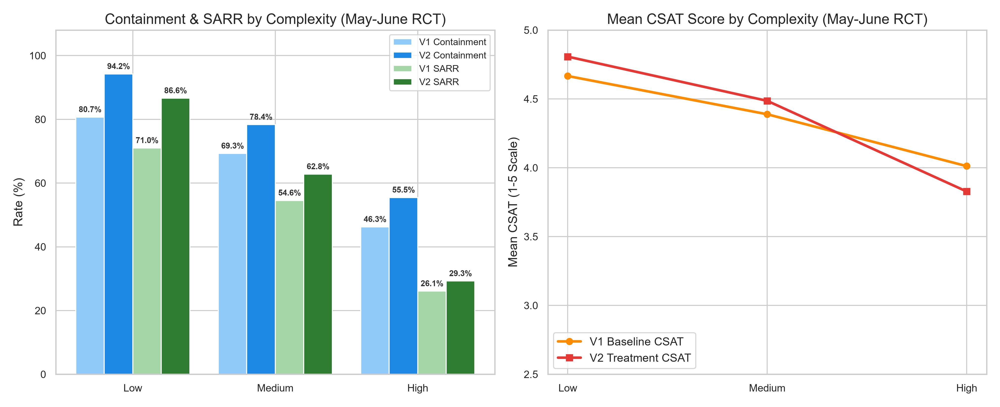
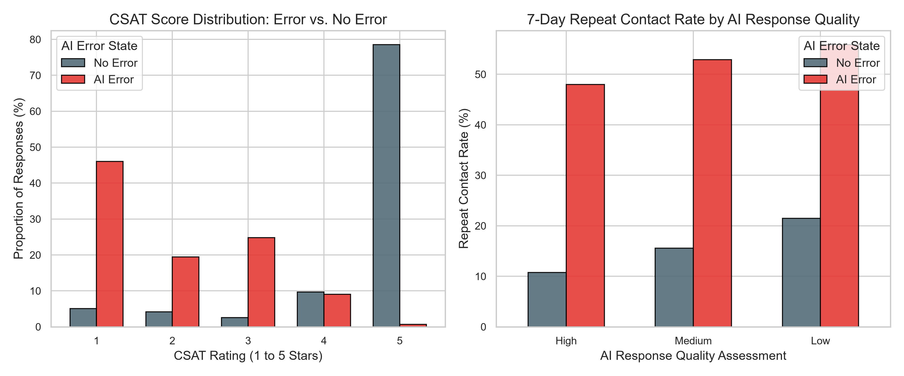
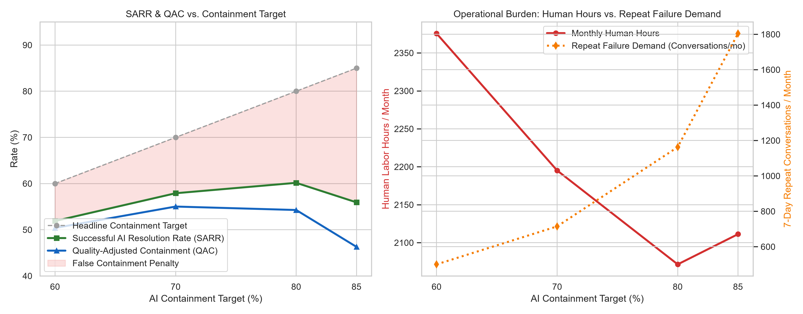

# AI Agent Performance & Optimization in Creator Support


[🌐 View Live Portfolio](https://mahimamittal2.github.io/youtube-ai-agent-analytics/) · [📖 Project Overview](case-study/project_overview.md)

An end-to-end analytics case study and decision framework evaluating conversational AI agent performance, experimental treatment effects, and operational workforce capacity in a simulated creator support environment.

> [!IMPORTANT]
> **Synthetic Data & Independence Disclosure**: This is an independent analytics case study using synthetic data. It does not use or represent Google/YouTube internal data, metrics, systems, methodologies, or confidential information.

| Project Snapshot | Details |
| :--- | :--- |
| **Dataset** | 120,000 synthetic conversations |
| **Creators** | ~25,000 simulated creators |
| **Period** | Jan–Aug 2026 |
| **Experiment** | Simulated randomized A/B test (May–June 2026) |
| **RCT Sample** | 19,404 conversations (50/50 split) |
| **North-Star Metric** | Successful AI Resolution Rate (SARR) |
| **Tools** | SQL (DuckDB) · Python · Power BI |

---

## Executive Result

AI Agent V2 improved Successful AI Resolution Rate (SARR) from:

### **54.26% → 64.11%**  
### **+9.85 percentage points (+18.16% relative lift, $p < 10^{-40}$)**

AI Agent V2 improved successful resolution and reduced AI error rates, but gains were highly heterogeneous by issue complexity. Low- and medium-complexity workflows captured approximately 94% of the incremental SARR gain observed in the simulated experiment, while high-complexity workflows showed substantially weaker resolution gains and a wider false-containment gap.

The data-driven recommendation was **Selective Rollout (Option B)**—deploying V2 across low- and medium-complexity workflows while routing complex policy inquiries to specialized human specialists—rather than universal deployment.

---

## Featured Visual


*Figure 1 (fig5): In the randomized controlled trial (N = 19,404), AI Agent V2 delivered a statistically significant +9.85 pp lift in SARR and cut AI error rates by 30.20%, with positive resolution lifts across major issue categories.*

---

## Key Findings

- **SARR Lift**: Increased from **$54.26\% \rightarrow 64.11\%$** ($+9.85\text{ pp}$ absolute lift, $+18.16\%$ relative lift, $p < 10^{-40}$).
- **Containment vs. Escalation:** Headline containment increased from 68.37% to 79.12% (+10.75 pp), while live human escalation fell from 31.63% to 20.88%.
- **AI Error Reduction**: Guardrail error rate decreased from **$4.38\% \rightarrow 3.06\%$** ($-30.20\%$ relative reduction, $p = 1.11 \times 10^{-6}$).
- **Complexity Divergence**: SARR surged by **$+15.63\text{ pp}$** in Low Complexity ($71.0\% \rightarrow 86.6\%$) but only gained **$+3.16\text{ pp}$** in High Complexity ($26.1\% \rightarrow 29.3\%$).
- **False Containment Wedge**: In High Complexity, the gap between containment and resolution expanded from **$20.2\text{ pp} \rightarrow 26.2\text{ pp}$** ($+6.1\text{ pp}$).
- **Failure Demand Multiplier**: Multivariate logistic regression confirms AI errors multiply 7-day repeat contact odds by **$4.46\times$** ($\text{OR} = 4.455, p = 1.19 \times 10^{-232}$).

---

## The Analytical Story

### 1. Measurement Framework
Traditional contact center metrics rely on **Containment Rate**, which treats every unescalated conversation as a success. However, high containment can mask silent abandonment. We defined the **Successful AI Resolution Rate (SARR)** as the primary North-Star KPI—requiring that an interaction be AI-handled, contained, genuinely resolved, and free of repeat contact within 7 days. The difference between containment and SARR defines the **False Containment Wedge**.

### 2. Experimentation
To evaluate AI Agent V2 against Baseline V1 without selection bias, a 60-day stratified randomized controlled trial was conducted ($N = 19,404$ active AI conversations). Randomization achieved near-perfect covariate balance across issue types, complexity tiers, creator tiers, and regions (Standardized Mean Differences $\le 0.0038$).

### 3. Segmentation (Heterogeneous Treatment Effects)
Evaluating performance across complexity tiers revealed that V2's performance is not uniform. In Low Complexity (40.2% of traffic), V2 performs strongly (+15.63 pp SARR lift). In High Complexity (20.0% of traffic), containment surged (+9.22 pp) while SARR stagnated (+3.16 pp), trapping creators in unhelpful automated loops.

### 4. AI Quality & Behavioral Impact
Multivariate logistic regression (free of target leakage) revealed that AI factual and policy errors are associated with a -56.0% decline in Mean CSAT (4.52 → 1.99 stars) and a 4.26× increase in 7-day repeat contact. False containment is associated with 47.7% higher repeat-contact odds (OR = 1.48).

### 5. Operational Capacity & Forecasting
A closed-loop operational capacity model was developed to translate AI performance into human support staffing requirements across 15,000 monthly conversations. Sensitivity modeling (60%, 70%, 80%, 85% containment) proved that pushing containment beyond ~80% causes false containment to surge by +59% and repeat failure demand by +55.1%, reversing labor savings and increasing total human labor hours from 2,071 to 2,111 hrs/month.

### 6. Strategic Decision
Rather than scaling broadly (Option A) or pausing rollout (Option C), the empirical evidence supports **Selective Rollout (Option B)**. Universally deploying V2 for Low and Medium complexity captures approximately 94% of the incremental SARR gains, while 1-turn human triage routing for High Complexity prevents the 26.2 pp false-containment trap.

---

## Repository Navigation & Deliverables

| Deliverable | Description | File Link |
| :--- | :--- | :--- |
| **Recruiter Portfolio Case Study** | Executive 7-section decision narrative designed for recruiters and hiring managers | [recruiter_case_study.md](case-study/recruiter_case_study.md) |
| **Full Technical Case Study** | Comprehensive 15-section exhaustive technical report | [case_study.md](case-study/case_study.md) |
| **Executive Briefing** | C-suite slide-ready summary and rollout roadmap | [executive_summary.md](case-study/executive_summary.md) |
| **Analytical Methodology** | Formal statistical proofs, A/B testing design, and capacity formulas | [methodology.md](docs/methodology.md) |
| **Metric Definitions** | Mathematical definitions and SQL formulas for all KPIs | [metric_definitions.md](docs/metric_definitions.md) |
| **Data Dictionary** | Table schemas and field definitions for all 5 entities | [data_dictionary.md](docs/data_dictionary.md) |
| **Power BI Dashboard Guide** | Star schema architecture, DAX measure library, and visual wireframes | [dashboard_guide.md](dashboard/powerbi/dashboard_guide.md) |

---

## Technical Implementation

| Area | Implementation Artifact | Key Methods & Tooling |
| :--- | :--- | :--- |
| **Data Generation** | [`python/01_data_generation.py`](python/01_data_generation.py) | Causal probabilistic DAG, 120k rows, NumPy/Pandas, Seed: 42 |
| **Data Quality** | [`python/02_data_quality.py`](python/02_data_quality.py) | Automated schema validation, range checks, foreign key tests |
| **Exploratory Analytics** | [`python/03_eda.py`](python/03_eda.py) | KPI distribution profiling, wedge isolation, Matplotlib/Seaborn |
| **Subgroup Segmentation** | [`python/04_segmentation.py`](python/04_segmentation.py) | Heterogeneous treatment effects, Statsmodels logistic regression |
| **A/B Experimentation** | [`python/05_ab_test.py`](python/05_ab_test.py) | Stratified hypothesis testing, Welch's t-test, Bootstrap CIs |
| **Capacity Forecasting** | [`python/06_forecasting.py`](python/06_forecasting.py) | Closed-loop queue dynamics, labor hours, annualized cost modeling |
| **Scenario Sensitivity** | [`python/07_scenario_analysis.py`](python/07_scenario_analysis.py) | 60/70/80/85% containment sweep, non-linear inflection modeling |
| **SQL Pipeline** | [`sql/`](sql/) | 10 modular SQL analysis scripts tested via DuckDB |
| **Business Intelligence** | [`dashboard/powerbi/`](dashboard/powerbi/) | Star schema data model, 3-page Power BI layout, DAX measures |

---

## Visual Gallery

| Visual | Description & Takeaway |
| :--- | :--- |
|  | **A/B Experiment Scorecard (fig5)**: AI Agent V2 delivers a statistically significant +9.85 pp lift in SARR and 30.20% reduction in AI error rates across the 60-day trial. |
|  | **False Containment Wedge (fig2)**: Headline containment masks true resolution across all categories, with the gap widening to >17 pp in complex policy/copyright domains. |
|  | **Complexity Interaction (fig3)**: Low complexity sees massive SARR gains (+15.63 pp), while High complexity suffers from over-containment and a CSAT inversion below baseline. |
|  | **AI Error Penalty (fig4)**: AI factual or policy errors are associated with a -56% decline in Mean CSAT (4.52 → 1.99 stars) and a 4.26x surge in 7-day repeat contact demand. |
|  | **Containment Sensitivity (fig7)**: Pushing containment beyond ~80% triggers a +55.1% spike in repeat failure demand, reversing labor savings and increasing monthly human hours. |

---

## How to Reproduce

```bash
# 1. Clone repository
git clone https://github.com/your-username/youtube-ai-agent-analytics.git
cd youtube-ai-agent-analytics

# 2. Set up virtual environment and install dependencies
python -m venv .venv
source .venv/bin/activate  # On Windows: .venv\Scripts\activate
pip install -r requirements.txt

# 3. Generate synthetic dataset (Seed: 42)
python python/01_data_generation.py

# 4. Run automated data quality assertions
python python/02_data_quality.py

# 5. Execute SQL analysis validation suite (DuckDB Engine)
python python/validate_sql.py

# 6. Execute statistical analysis & generate visuals
python python/03_eda.py
python python/04_segmentation.py
python python/05_ab_test.py
python python/06_forecasting.py
python python/07_scenario_analysis.py

# 7. Run full numerical audit suite
python python/audit_check.py
```

---

## Credibility & Disclaimer

- **Synthetic Data**: All 120,000 conversation records and creator profiles were synthetically generated using a fixed random seed (42) for statistical reproducibility.
- **Independent Project**: Authored by Mahima Mittal as an independent analytics portfolio case study.
- **No Confidential Information**: Does not utilize or disclose proprietary Google or YouTube data, internal systems, confidential roadmaps, or internal operational metrics.
- **Simulation Scope**: Experimental findings and scenario sweeps represent modeled simulation outcomes under stated analytical assumptions.
