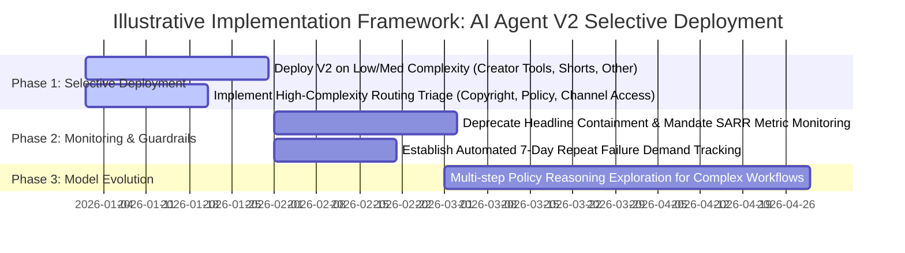

# Executive Briefing: AI Agent V2 Performance & Strategic Rollout Recommendation

**To**: Hypothetical Creator Support Leadership (VP of Creator Operations, Director of Product Management, AI Support Lead)  
**Author**: Mahima Mittal — Independent Analytics Case Study  
**Audience**: Hypothetical Creator Support Leadership  
**Date**: September 2026  
**Subject**: AI Agent V2 Controlled Experiment Evaluation & Rollout Decision  

> [!IMPORTANT]
> **Synthetic Data Disclosure**: This executive briefing is prepared as an independent analytics portfolio case study using synthetic data. It does not represent internal Google or YouTube data, metrics, or confidential methodologies.

---

## 1. Executive Summary & Decision

Following a simulated 60-day randomized controlled trial ($N = 19,404$ active AI conversations) modeled on YouTube Creator Support workflows, we evaluated whether **AI Agent V2** should be:
- **A. Scaled Broadly** across 100% of support traffic
- **B. Scaled Selectively** targeting specific issue categories and complexity tiers
- **C. Improved Before Rollout** by remediating high-complexity failure modes
- **D. Rolled Back** to Baseline V1

### The Decision: Scale Selectively (Option B)
We recommend **Selective Rollout (Option B)**. 

While AI Agent V2 demonstrates powerful headline improvements—increasing the **Successful AI Resolution Rate (SARR)** from **$54.26\%$ to $64.11\%$** ($+9.85\text{ pp}$, $p < 10^{-40}$) and reducing AI error rates by **$30.2\%$**—its performance is highly heterogeneous:
- **Low Complexity Inquiries**: V2 is exceptional, elevating SARR by **$+15.63\text{ pp}$** ($71.0\% \rightarrow 86.6\%$) with near-zero friction.
- **High Complexity Inquiries**: V2 over-contains (+9.22 pp containment lift), but fails to resolve (+3.16 pp SARR), widening the **false containment gap to $26.2\text{ pp}$** and generating severe failure demand (7-day repeat contacts).

By rolling out V2 universally across Low and Medium complexity queries while routing High Complexity workflows (Copyright, Policy, Channel Access) directly to human specialists, YouTube can capture **approximately $94\%$ of incremental successful-resolution gains from V2** while protecting creator sentiment and reducing downstream failure demand.

---

## 2. Controlled Experiment Scorecard (May 1 – June 30, 2026)

```
+---------------------------------------------------------------------------------------------------------+
| Metric Name                    | Control (V1) | Treatment (V2) | Lift (95% CI)              | Result    |
+--------------------------------+--------------+----------------+----------------------------+-----------+
| SARR (North Star)              | 54.26%       | 64.11%         | +9.85 pp [+8.48, +11.23]   | *** PASS  |
| AI Containment Rate            | 68.37%       | 79.12%         | +10.75 pp [+9.52, +11.98]  | *** PASS  |
| Human Escalation Rate          | 31.63%       | 20.88%         | -10.75 pp [-11.98, -9.52]  | *** PASS  |
| AI Error Rate (Guardrail)      |  4.38%       |  3.06%         | -1.32 pp [-1.86, -0.79]    | *** PASS  |
| Positive CSAT (Top-2 Box)      | 84.86%       | 85.80%         | +0.95 pp [-0.63, +2.52]    | n.s. Gained
| 7-Day Repeat Contact Rate      | 14.86%       | 14.35%         | -0.51 pp [-1.51, +0.48]    | n.s. Gained
| Median Latency                 | 3.89 sec     | 2.39 sec       | -1.50 sec                  | *** PASS  |
+---------------------------------------------------------------------------------------------------------+
*** Statistically significant at p < 0.001. n.s. = Directional gain, not statistically significant at alpha = 0.05.
```

---

## 3. Why Containment Failed as a Single Metric

Headline containment creates an optical illusion of success. When conversations are contained without true resolution ("False Containment"):
- **AI Errors Severely Degrade Satisfaction**: Mean CSAT falls from **$4.52 \rightarrow 1.99$ stars** ($-56\%$ drop).
- **Failure Demand Spikes**: 7-day repeat contact rate climbs from **$12.9\% \rightarrow 54.9\%$** ($4.25\times$ increase).
- **Inflection Point**: Pushing containment above $80\%$ triggers $+55\%$ higher repeat demand, increasing total human support hours by $+2\%$ per month (under modeled simulation assumptions).

---

## 4. Illustrative Implementation Framework

The following conceptual roadmap illustrates a phased implementation framework for selective deployment without referencing fixed internal production dates:


