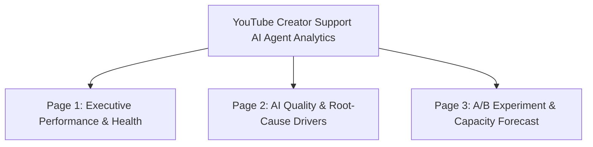

# Power BI Executive Dashboard Architecture & Visual Design Guide

> [!IMPORTANT]
> **Synthetic Data Disclosure**: This dashboard blueprint is designed for an independent simulated case study. It does not represent internal Google or YouTube dashboards or confidential reporting.

---

## Dashboard Overview & Visual Hierarchy

The Power BI report is organized into **three executive dashboard pages** tailored for Product Leads, Operations Directors, and Analytics Leadership:



---

## Page 1: Executive Performance & Operational Health

### Primary Purpose
Provide a single-pane executive summary of core AI performance, tracking adoption, containment, true SARR resolution, creator satisfaction, and human support queue workload over time.

### Visual Layout & Wireframe

```
+----------------------------------------------------------------------------------------------------+
| [Header] YouTube Creator Support AI Agent: Executive Performance Dashboard      [Date / Segment / Region Slicers] |
+----------------------------------------------------------------------------------------------------+
| [Card 1]           [Card 2]           [Card 3]           [Card 4]           [Card 5]           [Card 6]        |
| SARR (North Star)  AI Adoption Rate   AI Containment     Positive CSAT      7-Day Repeat Rate  Human Hours/Mo  |
| 57.7%              75.2%              72.1%              85.3%              14.4%              2,360 hrs       |
| (+8.2 pp vs V1)    (Stable)           (+9.5 pp vs V1)    (+1.1 pp)          (-0.5 pp)          (-150 hrs)      |
+----------------------------------------------------------------------------------------------------+
| [Visual 1: Area & Line Chart - 60% Width]                      | [Visual 2: Inbound Funnel - 40% Width]            |
| Monthly SARR vs. Containment (False Containment Wedge Shading) | Inbound Support Flow:                             |
| - Line 1: AI Containment Rate (72% -> 79%)                     | Inbound (15,000)                                  |
| - Line 2: SARR North Star (54% -> 64%)                         |  -> Eligible for AI (12,750 / 85%)                |
| - Shaded Area: False Containment Gap (14.4 pp)                 |   -> AI Used (9,560 / 75%)                        |
| - Tooltip: Error Rate, Repeat Rate, Escalations                |    -> Contained (7,560 / 79%)                     |
|                                                                |     -> SARR Resolved (6,120 / 64%)                |
|                                                                |   -> Live Escalated (2,000) + Repeat (1,100)     |
+----------------------------------------------------------------------------------------------------+
| [Visual 3: Clustered Column Chart - 50% Width]                 | [Visual 4: KPI Summary Table - 50% Width]         |
| Monthly Human Support Queue Volume & Labor Hours               | Creator Tier Performance Matrix:                  |
| - Direct Routing (Ineligible / Opt-out)                        | Tier | Vol | Adopt | Cont | SARR | CSAT | Hours|
| - Live Escalations                                             | Emerging | 45% | 80% | 76% | 61% | 86% | 950h |
| - 7-Day Repeat Failure Demand                                  | Growth   | 32% | 77% | 73% | 58% | 85% | 780h |
|                                                                | Establ.  | 18% | 72% | 68% | 52% | 84% | 480h |
|                                                                | Large    |  5% | 68% | 62% | 46% | 81% | 150h |
+----------------------------------------------------------------------------------------------------+
```

---

## Page 2: AI Quality, False Containment & Root-Cause Drivers

### Primary Purpose
Diagnose the operational drivers behind the gap between Containment and True Resolution, isolating high-friction issue categories, complexity interactions, and AI error impacts.

### Visual Layout & Wireframe

```
+----------------------------------------------------------------------------------------------------+
| [Header] AI Quality Diagnostics, False Containment & Root Causes               [Issue / Complexity Slicers]|
+----------------------------------------------------------------------------------------------------+
| [Visual 1: Scatter / Bubble Matrix - 55% Width]                | [Visual 2: Bar Breakdown - 45% Width]             |
| Issue Type Matrix: Containment vs. SARR (Bubble Size = Volume) | AI Quality Tier Distribution & Error Correlation: |
| - X-Axis: AI Containment Rate (%)                              | - High Quality:   65% Vol | 1.1% Err | CSAT: 4.8  |
| - Y-Axis: SARR Resolution Rate (%)                             | - Medium Quality: 24% Vol | 3.2% Err | CSAT: 4.2  |
| - Reference Line: 1:1 Identity (Zero False Containment)        | - Low Quality:    11% Vol | 22.5% Err| CSAT: 2.1  |
| - Quadrants: Star Performers vs False Containment Trap         |                                                   |
+----------------------------------------------------------------------------------------------------+
| [Visual 3: Stacked Bar Chart - 50% Width]                      | [Visual 4: CSAT & Friction Diagnostics - 50% Width] |
| Complexity Tier Wedge Breakdown (Low vs. Med vs. High):        | Impact of AI Error Occurrence on Creator Sentiment:|
| - Low:    80.7% Cont -> 71.0% SARR (Wedge: 9.7 pp)             | - No Error: 86.8% Positive CSAT | 12.9% Repeat Rate|
| - Medium: 69.3% Cont -> 54.6% SARR (Wedge: 14.7 pp)            | - AI Error: 18.2% Positive CSAT | 54.9% Repeat Rate|
| - High:   46.3% Cont -> 26.1% SARR (Wedge: 20.2 pp)            |   (Delta: -68.6 pp CSAT, +42.0 pp Repeat Rate)     |
+----------------------------------------------------------------------------------------------------+
```

---

## Page 3: A/B Experimentation & Capacity Forecast Scenarios

### Primary Purpose
Deliver statistical evaluation of the May–June A/B experiment (V1 vs. V2) and provide an interactive what-if capacity planner for leadership rollout decisions.

### Visual Layout & Wireframe

```
+----------------------------------------------------------------------------------------------------+
| [Header] A/B Experiment Evaluation & Capacity Forecast Scenarios               [Scenario Toggle: V1 / V2 / Sel] |
+----------------------------------------------------------------------------------------------------+
| [Section A: A/B Experiment Scorecard (May-June RCT)]                                               |
| Metric Name       | Control (V1) | Treatment (V2) | Abs Diff (95% CI)          | Rel Lift | Sig.   |
| SARR (North Star) | 54.26%       | 64.11%         | +9.85 pp [+8.48, +11.23]   | +18.16%  | ***    |
| AI Containment    | 68.37%       | 79.12%         | +10.75 pp [+9.52, +11.98]  | +15.73%  | ***    |
| Positive CSAT     | 84.86%       | 85.80%         | +0.95 pp [-0.63, +2.52]    | +1.12%   | n.s.   |
| AI Error Rate     | 4.38%        | 3.06%          | -1.32 pp [-1.86, -0.79]    | -30.20%  | ***    |
| Median Latency    | 3.89 sec     | 2.39 sec       | -1.50 sec                  | -38.56%  | ***    |
+----------------------------------------------------------------------------------------------------+
| [Visual 1: Grouped Bar - 50% Width]                            | [Visual 2: Sensitivity Curve - 50% Width]         |
| Heterogeneous Treatment Effects by Complexity:                 | Containment Sensitivity Curve (60%, 70%, 80%, 85%)|
| - Low SARR Lift:  +15.63 pp (71.0% -> 86.6%)                   | - Line 1: SARR Peak at ~80% (60.2%)               |
| - Med SARR Lift:  +8.25 pp  (54.6% -> 62.8%)                   | - Line 2: Repeat Failure Demand Spikes past 80%   |
| - High SARR Lift: +3.16 pp  (26.1% -> 29.3%)                   | - Threshold: Containment > 80% reduces efficiency |
|   (Wedge expands from 20.2 to 26.2 pp in High Complexity)      |                                                   |
+----------------------------------------------------------------------------------------------------+
| [Visual 3: Strategic Scenario Comparison - Full Width]                                             |
| Scenario Name          | Monthly Inbound | AI Cont% | SARR% | Human Queue/mo | Monthly Hours | Annual Cost|
| 1. Baseline (V1 Model) | 15,000          | 68.0%    | 54.5% | 9,320          | 2,403 hrs     | $1,297,719 |
| 2. Broad V2 Rollout    | 15,000          | 77.6%    | 61.1% | 8,566          | 2,250 hrs     | $1,214,943 |
| 3. Selective V2 Rollout| 15,000          | 66.4%    | 54.8% | 9,616          | 2,740 hrs     | $1,479,514 |
| Recommendation: Selective Rollout (Option B) avoids false containment in High Complexity.          |
+----------------------------------------------------------------------------------------------------+
```
