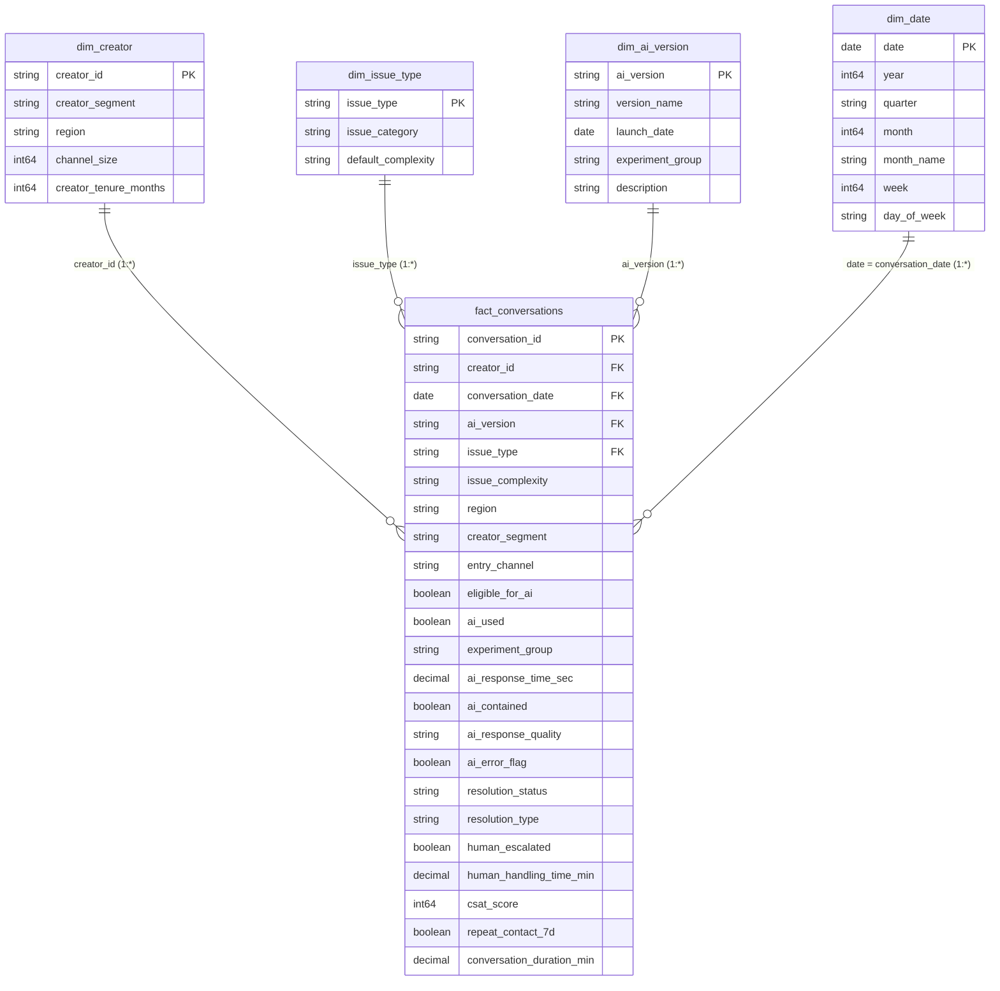

# Power BI Semantic Data Model & Star Schema Architecture

> [!IMPORTANT]
> **Synthetic Data Disclosure**: This semantic data model is designed for an independent analytics case study using synthetic data. It does not represent internal Google or YouTube data models.

---

## 1. Dimensional Model Overview

The analytical model is structured as an optimized **Dimensional Star Schema** centered around `fact_conversations` (120,000 rows):



---

## 2. Table Relationships & Cardinality

| From Table (Dimension) | From Column (PK) | To Table (Fact) | To Column (FK) | Cardinality | Cross Filter Direction | Active |
| :--- | :--- | :--- | :--- | :---: | :---: | :---: |
| `dim_creator` | `creator_id` | `fact_conversations` | `creator_id` | 1 to Many (1:*) | Single | Yes |
| `dim_issue_type` | `issue_type` | `fact_conversations` | `issue_type` | 1 to Many (1:*) | Single | Yes |
| `dim_ai_version` | `ai_version` | `fact_conversations` | `ai_version` | 1 to Many (1:*) | Single | Yes |
| `dim_date` | `date` | `fact_conversations` | `conversation_date` | 1 to Many (1:*) | Single | Yes |

---

## 3. Storage Mode & Refresh Configuration

- **Storage Mode**: Import Mode (in-memory VertiPaq engine).
- **Total Dataset Size**: ~120,000 rows ($\approx 14 \text{ MB}$ uncompressed CSV, $\approx 2.5 \text{ MB}$ compressed VertiPaq).
- **Date Range**: January 1, 2026 – August 31, 2026.
- **Date Hierarchy**: Year $\rightarrow$ Quarter $\rightarrow$ Month $\rightarrow$ Week $\rightarrow$ Day.

---

## 4. Calculated Columns & Formatting Rules

1. `dim_date[Month Year]` = `FORMAT(dim_date[date], "mmm yyyy")` (Sorted by `dim_date[YearMonthKey]`).
2. `fact_conversations[Is SARR Success]` = 
   ```dax
   IF(
       fact_conversations[ai_used] = TRUE() &&
       fact_conversations[ai_contained] = TRUE() &&
       fact_conversations[resolution_type] = "AI_Resolved" &&
       fact_conversations[repeat_contact_7d] = FALSE(),
       1, 
       0
   )
   ```
3. `fact_conversations[False Containment Flag]` = 
   ```dax
   IF(
       fact_conversations[ai_contained] = TRUE() && 
       fact_conversations[Is SARR Success] = 0,
       1,
       0
   )
   ```
