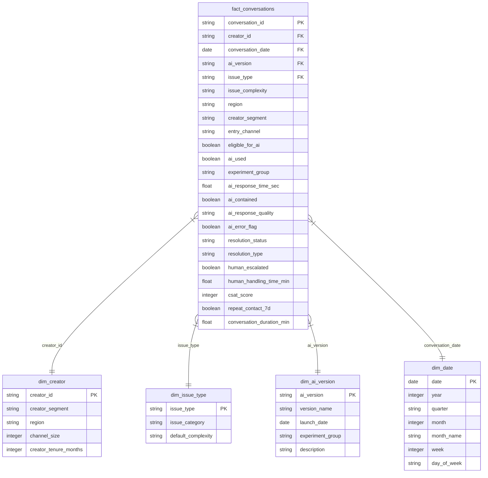

# Data Dictionary: YouTube Creator Support AI Agent Analytics

> [!IMPORTANT]
> **Synthetic Data Disclosure**: This dataset is completely synthetic and simulated for analytical demonstration. It does not contain, represent, or mirror any confidential YouTube, Google, or creator information.

---

## 1. Table Overview & Entity Relationship Model

The data architecture is organized as a dimensional star schema centered around individual creator support conversations:

---

## 2. Table: `fact_conversations`

- **Primary Key**: `conversation_id`
- **Granularity**: 1 row = 1 support conversation
- **Target Volume**: ~120,000 rows
- **Date Range**: January 1, 2026 – August 31, 2026 (243 days)

| Column Name | Data Type | Nullable | Allowed Values / Range | Description |
| :--- | :--- | :---: | :--- | :--- |
| `conversation_id` | `VARCHAR(32)` | No | `CNV-2026-XXXXXXX` | Unique identifier for the support interaction. |
| `creator_id` | `VARCHAR(16)` | No | `CRT-XXXXX` | Identifier for the creator initiating support. Foreign key to `dim_creator`. |
| `conversation_date` | `DATE` | No | `2026-01-01` to `2026-08-31` | Date the conversation was initiated. Foreign key to `dim_date`. |
| `ai_version` | `VARCHAR(16)` | No | `'V1'`, `'V2'`, `'None'` | The AI agent model version deployed for this interaction. Foreign key to `dim_ai_version`. |
| `issue_type` | `VARCHAR(32)` | No | `'Monetization'`, `'Copyright'`, `'Revenue & Payments'`, `'Channel Access'`, `'Creator Tools'`, `'Memberships'`, `'Policy'`, `'Analytics'`, `'Shorts'`, `'Other'` | Category of creator inquiry. Foreign key to `dim_issue_type`. |
| `issue_complexity` | `VARCHAR(16)` | No | `'Low'`, `'Medium'`, `'High'` | Estimated difficulty/nuance of the issue. |
| `region` | `VARCHAR(32)` | No | `'US'`, `'India'`, `'UK'`, `'Canada'`, `'Southeast Asia'`, `'Other'` | Operational geographical region of the creator. |
| `creator_segment` | `VARCHAR(16)` | No | `'Emerging'`, `'Growth'`, `'Established'`, `'Large'` | Creator classification tier based on subscriber scale. |
| `entry_channel` | `VARCHAR(32)` | No | `'Creator_Studio'`, `'Help_Center'`, `'Mobile_App'`, `'Email_Form'` | Ingestion channel where support request originated. |
| `eligible_for_ai` | `BOOLEAN` | No | `TRUE`, `FALSE` | Flag indicating whether the interaction was eligible for AI routing (~85% baseline). |
| `ai_used` | `BOOLEAN` | No | `TRUE`, `FALSE` | Flag indicating whether the creator entered the AI agent workflow. |
| `experiment_group` | `VARCHAR(32)` | No | `'Pre_Experiment'`, `'Control_V1'`, `'Treatment_V2'`, `'Post_Experiment'`, `'Non_Experiment'` | Lifecycle and A/B test assignment tag. |
| `ai_response_time_sec`| `FLOAT` | Yes | `0.5` to `30.0` (Null if `ai_used = FALSE`) | Initial AI message generation and latency in seconds. |
| `ai_contained` | `BOOLEAN` | No | `TRUE`, `FALSE` | `TRUE` if interaction was handled without live human escalation. |
| `ai_response_quality` | `VARCHAR(16)` | Yes | `'High'`, `'Medium'`, `'Low'` (Null if `ai_used = FALSE`) | Objective evaluation of AI answer relevancy, clarity, and tone. |
| `ai_error_flag` | `BOOLEAN` | No | `TRUE`, `FALSE` | `TRUE` if AI output contained a hallucination, incorrect policy advice, or misleading steps. |
| `resolution_status` | `VARCHAR(16)` | No | `'Resolved'`, `'Unresolved'`, `'Abandoned'` | End state of the support session from the creator/system standpoint. |
| `resolution_type` | `VARCHAR(32)` | No | `'AI_Resolved'`, `'Human_Resolved'`, `'Unresolved_Contained'`, `'Unresolved_Escalated'`, `'Abandoned'` | Detailed classification of how the ticket terminated. |
| `human_escalated` | `BOOLEAN` | No | `TRUE`, `FALSE` | `TRUE` if a human support specialist handled or received an escalated transfer. |
| `human_handling_time_min`| `FLOAT` | Yes | `1.0` to `60.0` (0.0 or Null if `human_escalated = FALSE`) | Active time spent by a human specialist handling the conversation. |
| `csat_score` | `INTEGER` | Yes | `1`, `2`, `3`, `4`, `5` (Null if survey not completed) | Creator satisfaction score (1 = Very Dissatisfied, 5 = Very Satisfied). |
| `repeat_contact_7d` | `BOOLEAN` | No | `TRUE`, `FALSE` | `TRUE` if creator re-opened or submitted another support request within 7 days. |
| `conversation_duration_min`| `FLOAT` | No | `0.5` to `90.0` | Total session wall-clock elapsed time from opening to close. |

---

## 3. Table: `dim_creator`

- **Primary Key**: `creator_id`
- **Granularity**: 1 row = 1 unique creator channel
- **Volume**: ~25,000 unique creators

| Column Name | Data Type | Nullable | Example / Range | Description |
| :--- | :--- | :---: | :--- | :--- |
| `creator_id` | `VARCHAR(16)` | No | `CRT-10492` | Unique creator identifier. |
| `creator_segment` | `VARCHAR(16)` | No | `'Emerging'`, `'Growth'`, `'Established'`, `'Large'` | Creator tier. |
| `region` | `VARCHAR(32)` | No | `'US'`, `'India'`, `'UK'`, `'Canada'`, `'Southeast Asia'`, `'Other'` | Primary registered operating region. |
| `channel_size` | `INTEGER` | No | `100` to `25,000,000` | Current subscriber count. |
| `creator_tenure_months`| `INTEGER` | No | `1` to `120` | Tenure on platform in months. |

---

## 4. Table: `dim_issue_type`

- **Primary Key**: `issue_type`
- **Granularity**: 1 row = 1 standard issue type category

| Column Name | Data Type | Nullable | Values | Description |
| :--- | :--- | :---: | :--- | :--- |
| `issue_type` | `VARCHAR(32)` | No | 10 distinct issue types | Canonical issue name. |
| `issue_category` | `VARCHAR(32)` | No | `'Monetization & Rights'`, `'Channel & Tools'`, `'Policy & Safety'`, `'Content & Discovery'` | Higher-order analytical cluster. |
| `default_complexity`| `VARCHAR(16)` | No | `'Low'`, `'Medium'`, `'High'` | Baseline operational complexity expectation. |

---

## 5. Table: `dim_ai_version`

- **Primary Key**: `ai_version`
- **Granularity**: 1 row = 1 AI agent engine version

| Column Name | Data Type | Nullable | Values | Description |
| :--- | :--- | :---: | :--- | :--- |
| `ai_version` | `VARCHAR(16)` | No | `'V1'`, `'V2'`, `'None'` | Model release version tag. |
| `version_name` | `VARCHAR(64)` | No | `'Baseline Creator Agent'`, `'Enhanced LLM Reasoning Agent'`, `'Direct Human Routing'` | Descriptive product name. |
| `launch_date` | `DATE` | No | `2025-10-01`, `2026-05-01`, `2024-01-01` | Initial deployment / test date. |
| `experiment_group` | `VARCHAR(32)` | No | `'Control / Baseline'`, `'Treatment / Improved Agent'`, `'Non-AI Route'` | Role in A/B test lifecycle. |
| `description` | `VARCHAR(255)`| No | Free text | Model architecture and prompt tuning summary. |

---

## 6. Table: `dim_date`

- **Primary Key**: `date`
- **Granularity**: 1 row = 1 calendar day (2026-01-01 to 2026-08-31)

| Column Name | Data Type | Nullable | Values | Description |
| :--- | :--- | :---: | :--- | :--- |
| `date` | `DATE` | No | `2026-01-01` to `2026-08-31` | Calendar date. |
| `year` | `INTEGER` | No | `2026` | Calendar year. |
| `quarter` | `VARCHAR(2)` | No | `'Q1'`, `'Q2'`, `'Q3'` | Calendar quarter. |
| `month` | `INTEGER` | No | `1` to `8` | Calendar month number. |
| `month_name` | `VARCHAR(16)` | No | `'January'`, `'February'`, ... | Full month name. |
| `week` | `INTEGER` | No | `1` to `35` | ISO week number. |
| `day_of_week` | `VARCHAR(16)` | No | `'Monday'`, `'Tuesday'`, ... | Day of week name. |
