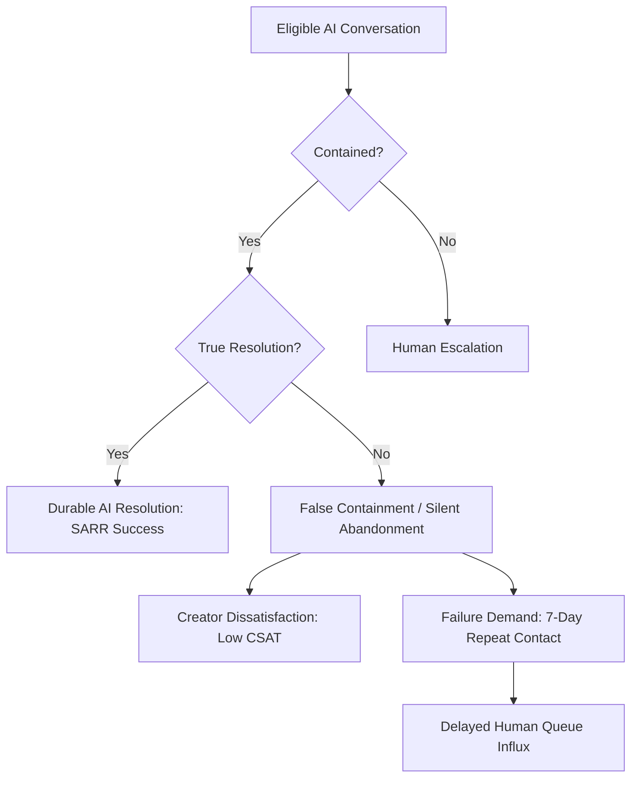
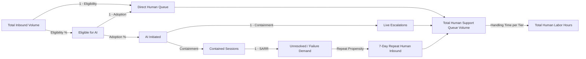

# Analytical Methodology & Statistical Framework

> [!IMPORTANT]
> **Synthetic Data Disclosure**: This document details the statistical methodologies and operational modeling frameworks developed for an independent creator support AI simulation study.

---

## 1. Measurement Philosophy: Why Containment Fails

Traditional contact center analytics often over-index on **Containment Rate** as a proxy for automation success because it measures direct operational deflection. However, in generative AI systems, high containment can mask four severe forms of customer friction:

1. **False Containment (Premature Deflection)**: The AI delivers a generic or unhelpful answer, and the creator exits without resolving their issue or knowing how to escalate.
2. **Failure Demand**: An unresolved or hallucinated AI response forces the creator to open a second or third ticket within 7 days, consuming human agent bandwidth later at higher handling times.
3. **Severe Brand & Sentiment Erosion**: Frustrated creators assign low CSAT ratings (1 or 2 stars), damaging platform trust.
4. **The "Wedge" Phenomenon**: As AI containment is pushed aggressively through strict gating, the gap (wedge) between headline containment and **Successful AI Resolution Rate (SARR)** widens.

---

## 2. A/B Experimentation Design (May 1 – June 30, 2026)

### Stratified Randomization & Covariate Balance Verification
To ensure unbiased treatment effect estimation of AI Agent V2 versus Baseline V1, conversations during the 60-day experiment window are randomized with equal probability ($p=0.50$) stratified across:
- **Issue Type** (10 strata)
- **Complexity Tier** (3 strata)
- **Creator Segment** (4 strata)
- **Geographic Region** (6 strata)

#### Balance Verification Standards:
- Covariate balance is verified using **Absolute Proportion Differences** ($\max |\Delta p|$) and **Standardized Mean Differences (SMD)**:
  $$\text{SMD} = \frac{|\bar{X}_{\text{treatment}} - \bar{X}_{\text{control}}|}{\sqrt{\frac{s_{\text{treatment}}^2 + s_{\text{control}}^2}{2}}}$$
- An $\text{SMD} < 0.05$ (and $|\Delta p| < 0.015$) confirms strong distributional balance.
- Hypothesis tests (e.g., Chi-Square) are reported only as supplementary diagnostics; failure to reject imbalance ($p > 0.05$) is not treated as proof of balance.

### Statistical Hypothesis Testing Framework

#### Primary Hypothesis: SARR Uplift
- $H_0: \text{SARR}_{V2} = \text{SARR}_{V1}$
- $H_1: \text{SARR}_{V2} \neq \text{SARR}_{V1}$
- **Test**: Two-Sample Z-Test for Proportions and 95% Wilson Score Confidence Intervals.

$$Z = \frac{\hat{p}_{V2} - \hat{p}_{V1}}{\sqrt{\hat{p}_{\text{pool}}(1 - \hat{p}_{\text{pool}})\left(\frac{1}{n_{V2}} + \frac{1}{n_{V1}}\right)}}$$

#### Secondary & Continuous Metrics
- **CSAT & Latency**: Welch's two-sample t-test (unequal variances assumed) and 1,000-iteration nonparametric Bootstrap Confidence Intervals for difference in medians and means.
- **Guardrails**: One-sided non-inferiority checks on AI Error Rate ($\Delta \le 0$) and False Containment Rate.

---

## 3. Heterogeneous Treatment Effects (HTE)

Treatment effects are evaluated conditionally across complexity tiers and issue categories:
$$\tau(x) = \mathbb{E}[Y_i(1) - Y_i(0) \mid X_i = x]$$

Where:
- $Y_i$ is SARR or CSAT,
- $X_i \in \{\text{Low}, \text{Medium}, \text{High Complexity}\} \times \{\text{Issue Types}\}$.

This segmentation determines whether V2 should be rolled out universally across all tickets or selectively targeted at low/medium complexity workflows while routing complex queries directly or early to human specialists.

---

## 4. Closed-Loop Operational Demand Forecasting

The operational capacity model translates AI performance into human support staffing requirements by accounting for direct routing, escalations, and downstream repeat demand:

### Mathematical Formulation of Human Queue Volume ($V_H$):
$$V_H = V_{\text{total}} \cdot (1 - \text{Eligible} \times \text{Adoption}) + V_{\text{AI}} \cdot (1 - \text{Containment}) + V_{\text{AI}} \cdot \text{Containment} \cdot (1 - \text{Resolution}_{\text{contained}}) \cdot \rho_{\text{repeat}}$$

Where $\rho_{\text{repeat}}$ is the probability that an unresolved contained session returns as a human-routed support contact.

---

## 5. Multivariate Driver Modeling & Target-Leakage Prevention

To model the drivers of downstream failure demand (`repeat_contact_7d`), the logistic regression specification enforces strict temporal and causal separation:

$$\text{logit}\big(P(\text{repeat\_contact\_7d} = 1)\big) = \beta_0 + \beta_1 \cdot \text{is\_resolved} + \beta_2 \cdot \text{is\_error} + \beta_3 \cdot \text{is\_false\_contained} + \sum \beta_c \cdot \text{Complexity}_c$$

### Predictor Construction Standards:
1. **`is_resolved`**: $\mathbf{1}(\text{resolution\_status} = \text{'Resolved'})$ reflects immediate primary-interaction resolution status.
2. **`is_false_contained`**: $\mathbf{1}\big(\text{ai\_contained} = \text{True} \land (\text{resolution\_status} = \text{'Unresolved'} \lor \text{ai\_error\_flag} = \text{True})\big)$ isolates premature session termination.
3. **Target-Leakage Guarantee**: The dependent outcome is temporally separated from the predictor construction, and no predictor uses `repeat_contact_7d` in its definition.
